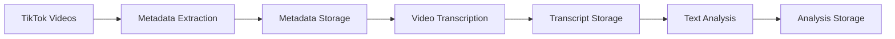

<p align="center">

</p>

<h1 align="center">TikTok Analytics Pipeline</h1>

<p align="center">
    
    
    
    
</p>

## Overview
This project implements a scalable data pipeline for analyzing TikTok videos using AWS services. It extracts video metadata and content, performs transcription and text analysis, and stores the results for further analysis.

## Architecture

### ETL Pipeline

1. **Metadata Extraction**
   - Downloads video metadata using yt-dlp
   - Extracts key information like views, likes, comments
   - Runs on AWS Batch Fargate containers
   - Stores results in S3

2. **Video Transcription** 
   - Triggered automatically via SNS when new metadata arrives in S3
   - Uses WhisperX for GPU-accelerated transcription
   - Runs on AWS Batch GPU instances (g4dn.xlarge)
   - Stores transcripts in S3, triggering SNS notifications

3. **Text Analysis**
   - Triggered automatically via SNS when new transcripts arrive in S3
   - Extracts categories, summaries, and keywords from transcripts and metadata using OpenAI GPT
   - Runs on AWS Batch Fargate containers
   - Stores analysis results in S3, triggering SNS notifications for downstream processing

### Data Lake Structure
The data is organized in an S3-based data lake with the following structure:

```
s3://tiktoktrends/
├── videos/
│   ├── metadata/                 # Raw video metadata
│   │   ├── profile=<profile>/
│   │   │   └── processed_at=<timestamp>/
│   │   │       └── metadata.parquet
│   ├── transcripts/             # Video transcripts
│   │   └── profile=<profile>/
│   │       └── processed_at=<timestamp>/
│   │           └── transcripts.parquet
│   └── text/                    # Analyzed text data
│       ├── profile=<profile>/
│       │   └── processed_at=<timestamp>/
│       │       └── analysis.parquet
└── athena-results/              # Athena query results
```

### AWS Glue Data Catalog
The data lake is cataloged using AWS Glue with the following structure:

#### Database: `tiktok_analytics`
Contains tables for querying TikTok video metadata and text analysis results.

##### Table: `metadata`
Stores video metadata in Parquet format with Hive-style partitioning:
- Partition Keys:
  - `profile` (string)
  - `processed_at` (string)
- Columns:
  - `id` (string)
  - `title` (string)
  - `description` (string)
  - `upload_date` (bigint)
  - `like_count` (bigint)
  - `repost_count` (bigint)
  - `comment_count` (bigint)
  - `view_count` (bigint)
  - `duration` (bigint)
  - `webpage_url` (string)
  - `channel` (string)
  - `timestamp` (bigint)
  - `track` (string)
  - `artists` (array<string>)
  - `artist` (string)
  - `uploader` (string)

##### Table: `text_analysis`
Stores processed text data in Parquet format with Hive-style partitioning:
- Partition Keys:
  - `profile` (string)
  - `processed_at` (string)
- Columns:
  - `id` (string)
  - `uploader` (string)
  - `description` (string)
  - `title` (string)
  - `transcript` (string)
  - `language` (string)
  - `category` (string)
  - `summary` (string)
  - `keywords` (array<string>)

#### Partition Management
The system automatically manages partitions through Lambda functions triggered by S3 events using Athena ALTER TABLE statements, ensuring that new data is immediately queryable through Athena without manual intervention or partition discovery jobs.

### Infrastructure

The pipeline is built using AWS CDK with Python and includes:

- **Networking**: VPC with public/private subnets
- **Compute**: AWS Batch compute environments (ECS and Fargate)
- **Storage**: S3 buckets for data storage
- **Serverless**: Lambda functions for pipeline orchestration
- **Security**: IAM roles and security groups
- **Containers**: ECR repositories for Docker images

## Technologies Used

### Core Services


### AI/ML


### Development


### Visualization


## Development Setup

### Prerequisites
- Python 3.9+
- Git
- AWS Account

### Automatic Setup
1. Clone the repository:
```bash
git clone https://github.com/yourusername/tiktok-analytics.git
cd tiktok-analytics
```

2. Run the setup script:
```bash
chmod +x setup.sh
./setup.sh
```

### Manual Setup
If you prefer to set up manually:

1. Create Python virtual environment:
```bash
python3 -m venv .venv
source .venv/bin/activate
pip install -r requirements.txt
```

2. Install Node.js 20 using nvm:
```bash
curl -o- https://raw.githubusercontent.com/nvm-sh/nvm/v0.39.0/install.sh | bash
nvm install 20
nvm use 20
```

3. Install AWS CDK:
```bash
npm install -g aws-cdk
```

### Verify Installation
```bash
# Check Python environment
python --version
pip list

# Check Node.js version
node --version

# Check CDK version
cdk --version
```

## Pipeline Flow



## Contributing
Contributions are welcome! Please feel free to submit a Pull Request.

## License
This project is licensed under the MIT License - see the LICENSE file for details.